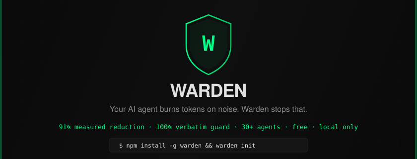

<p align="center">
  
</p>

<p align="center">
  <strong>Your AI agent burns tokens on noise. Warden stops that.</strong>
</p>

<p align="center">
  <a href="https://www.npmjs.com/package/warden-ai"></a>
  <a href="LICENSE"></a>
  <a href="#works-with-30-agents"></a>
  <a href="#tests"></a>
  <a href="#trust-guard"></a>
  <a href="#privacy"></a>
  <a href="https://github.com/rynald0cst0ltziam/Warden-AI/commits/main"></a>
</p>

<p align="center">
  <a href="#install">Install</a> ·
  <a href="#before--after">Before / After</a> ·
  <a href="#what-it-does">What it does</a> ·
  <a href="#trust-guard">Trust guard</a> ·
  <a href="#commands">Commands</a> ·
  <a href="#mcp-tools">MCP tools</a> ·
  <a href="#privacy">Privacy</a>
</p>

<br>

Warden is an MCP server for Claude Code, Cursor, Codex, Windsurf, Cline, Gemini, and 30+ other agents. Install once. Warden prunes tool output, compresses responses, indexes your codebase, and remembers decisions across sessions — then proves every cut is safe with a verifiable trust guard.

## Install

```bash
# npm
npm install -g warden-ai && warden init

# or curl (macOS · Linux · WSL · Git Bash)
curl -fsSL https://raw.githubusercontent.com/rynald0cst0ltziam/Warden-AI/main/install.sh | bash
```

~10 seconds · Node ≥ 22.5 · skips agents you don't have · safe to re-run

`warden init` does everything:

| | Step | What happens |
|:-:|:-----|:-------------|
| 1 | **Register** | Warden registered as MCP server in all detected agents (30+) |
| 2 | **Rules** | Agent rules files written (CLAUDE.md, AGENTS.md, .cursorrules, etc.) |
| 3 | **Index** | Code index built — call graph, imports, symbols, dead code |
| 4 | **Compress** | Memory files compressed to save tokens every future session |

**Restart your IDE. Start working normally.** Warden runs automatically — no commands to remember, no settings to tune, no levels to pick. Max compression is always on.

> **See it working:** your agent prints `‹warden› saved 4295 tokens (79%)` on every tool call. Run `warden hud` for a live terminal HUD. Run `warden dashboard` for a web UI at http://localhost:7878.

<details>
<summary><b>Install for one agent, or see what's detected</b></summary>

```bash
warden doctor          # see which agents are detected (16 checks)
warden init            # re-register after installing a new agent
warden benchmark       # see real benchmark numbers on your own files
```

Warden detects and registers for: Claude Code, Claude Desktop, Cursor, Windsurf, Codex CLI, Cline, Roo Code, Continue, VS Code Copilot, Zed, JetBrains, Amazon Q, Gemini CLI, Antigravity, Aider, Goose, OpenHands, opencode, Augment Code, Warp, Cody, Tabnine, Replit AI, and more.

</details>

<br>

## Before / After

Same grep query. Same information. **79% fewer tokens.**

<table>
<tr>
<th>🔴 Without Warden — 4,295 tokens</th>
<th>🟢 With Warden — 883 tokens</th>
</tr>
<tr>
<td>

```text
$ grep -rn "function auth" src/
src/auth/login.ts:15:export function login(user) {
src/auth/login.ts:16:  const token = signJWT(user);
src/auth/login.ts:17:  if (!token) throw new Error("no token");
src/auth/login.ts:18:  return { token, user };
src/auth/login.ts:19:}
src/auth/middleware.ts:45:export function
  authMiddleware(req, res, next) {
src/auth/middleware.ts:46:  const token =
  req.headers.authorization;
src/auth/middleware.ts:47:  if (!token) return
  res.status(401).send("no token");
src/auth/middleware.ts:48:  try {
src/auth/middleware.ts:49:    const payload = verify(token);
src/auth/middleware.ts:50:    req.user = payload.user;
src/auth/middleware.ts:51:    next();
src/auth/middleware.ts:52:  } catch (e) {
src/auth/middleware.ts:53:    return res.status(401).send(
      "invalid token");
... (138 more matches)
```

</td>
<td>

```text
warden_grep({ pattern: "function auth" })

  200 matches → 12 relevant
  ‹warden› removed 50 duplicates
  ‹warden› collapsed 138 low-signal
  guard: every line verbatim ✓
  saved: 4295 → 883 tokens (-79%)

  src/auth/login.ts:15
    export function login(user)
  src/auth/login.ts:22
    export function logout()
  src/auth/middleware.ts:45
    authMiddleware(req,res,next)
  src/auth/token.ts:8
    export function generateToken()
  src/auth/token.ts:31
    export function verifyToken()
  ... 7 more
  (use warden_retrieve for full)
```

</td>
</tr>
</table>

Every line in the pruned output exists verbatim in the raw — verified by the trust guard.

<br>

## What it does

**Eight layers. One MCP server. Zero config.**

| # | Layer | What it does | Savings |
|:-:|:------|:-------------|:-------:|
| 1 | **Code intelligence** | Index functions, imports, call sites. Query call graph, impact, architecture, dead code | 100x fewer round trips |
| 2 | **Context selection** | `warden_context_select` recommends files for the task — with 2-hop symbol expansion | 80%+ smaller context |
| 3 | **Tool output pruning** | `warden_grep`, `warden_file_read`, `warden_run_tests`, `warden_run_command` — AST outlines for file reads | 50-91% per call |
| 4 | **Agent memory** | Decisions persist across sessions. Auto-surfaces at session start | 0 repeated context |
| 5 | **Response compression** | Rules drop filler, preamble, narration. Code/errors stay verbatim. Auto-clarity for safety | 45-65% per reply |
| 6 | **File compression** | `warden compress` strips filler from memory files. Deterministic, no LLM call | up to 32% per file |
| 7 | **Description compression** | 24 tool descriptions compressed before sending | ~41% per turn |
| 8 | **Session continuity** | `warden_handoff` reads previous session at start, generates summary at end. Automatic | 0 cold starts |

### Safety net — always on

| Mechanism | What it does |
|:----------|:-------------|
| **Trust guard** | Every pruned line verified verbatim against raw. If altered, raw ships instead. |
| **Eval gate** | Rules earn confidence through real samples before going live. |
| **Regression watchdog** | Tracks task success rates. Auto-reverts rules that degrade outcomes. |
| **CCR** | Every cut reversible. Full original cached 7 days. `warden_retrieve` with `--around` and `--lines`. |

<br>

## Code intelligence

```js
// Who calls auth() and what does auth() call?
warden_call_graph({ function: "auth" })
// → Callers: login(), UserService.isValid()
//   Callees: checkToken(), generateToken()

// What's affected if I change src/auth.ts?
warden_impact({ filePath: "src/auth.ts" })
// → Risk: HIGH — 5 dependents, 12 callers

// Project overview in one call
warden_architecture({})
// → TypeScript: 57 files, 251 symbols, 2061 calls

// Find dead code
warden_dead_code({})
// → 3 functions with zero callers

// Search for symbols
warden_search_symbols({ pattern: "auth" })
// → 8 matches across 4 files
```

Supports **TypeScript, JavaScript, Python** — functions, classes, methods, interfaces, types, enums, imports, call sites.

<br>

## Trust guard

40 lines. Read them yourself.

```text
src/pruner/guard.ts — the non-negotiable rule:

Every non-annotation line in the pruned output
must appear verbatim in the raw output.
If it doesn't, the raw is shipped instead.
No exceptions. No heuristics. No silent rewrites.
```

Code, shell commands, and error text are **included-or-excluded wholesale** — never altered. **Safety first, optimization second.**

<br>

## Works with 30+ agents

| | | | | |
|:---:|:---:|:---:|:---:|:---:|
| Claude Code | Claude Desktop | Cursor | Windsurf | Codex CLI |
| Cline | Roo Code | Continue | VS Code Copilot | Zed |
| JetBrains | Amazon Q | Gemini CLI | Antigravity | Aider |
| Goose | OpenHands | opencode | Augment Code | Warp |
| Cody | Tabnine | Replit AI | + more | |

**If your agent supports MCP, Warden works with it.**

<br>

## Commands

| Command | What it does |
|:--------|:-------------|
| `warden init` | Register in all agents + write rules + build index + compress files |
| `warden serve` | Run MCP server over stdio (called by agents automatically) |
| `warden status` | Rules, confidence, tokens saved, recent memories |
| `warden hud` | Live terminal HUD (Ctrl+C to exit) |
| `warden dashboard` | Web UI at http://localhost:7878 |
| `warden doctor` | Health check — 16 checks, clear pass/fail |
| `warden benchmark` | Run actual benchmarks on real files |
| `warden compress <file>` | Compress a memory file (max compression) |
| `warden index` | Index project code structure |
| `warden graph <fn>` | Query call graph: who calls X / what X calls |
| `warden impact <file>` | Impact analysis: blast radius of changes |
| `warden architecture` | Project overview: languages, packages, entry points |
| `warden handoff` | Generate session handoff for next session |
| `warden handoff --read` | Read previous session's handoff |
| `warden ccr` | CCR cache stats |
| `warden ccr retrieve <hash>` | Retrieve original output (`--around`, `--lines`) |
| `warden memory list` | List all stored memories |
| `warden memory recall <query>` | Search memories |
| `warden rules` | Write agent rules files |

<br>

## MCP tools

**24 tools. All called automatically by your agent via the rules file.**

| Category | Tools |
|:---------|:------|
| **Tool wrappers** | `warden_grep` · `warden_file_read` · `warden_run_tests` · `warden_run_command` |
| **Context & intelligence** | `warden_context_select` · `warden_index` · `warden_call_graph` · `warden_impact` · `warden_architecture` · `warden_search_symbols` · `warden_dead_code` |
| **Memory** | `warden_memory_save` · `warden_memory_recall` · `warden_memory_list` · `warden_memory_forget` |
| **Eval & outcomes** | `warden_record_outcome` · `warden_outcome_stats` |
| **Status & audit** | `warden_status` · `warden_report` · `warden_prune` · `warden_compress` |
| **CCR (reversibility)** | `warden_retrieve` · `warden_ccr_status` |
| **Session continuity** | `warden_handoff` — `read: true` at start, generate at end |

<br>

## Privacy

```text
No cloud. No API server. No telemetry. No analytics. No phone-home.
Your code, tool outputs, and pruning decisions stay in a local SQLite
file on your machine. It works on a plane.
```

The only network code: **localhost-only dashboard** — bound to 127.0.0.1, no external access.

Audit it yourself — it's open source. The trust guard is 40 lines in `src/pruner/guard.ts`.

<br>

## Tests

```text
$ npx vitest run

Test Files  20 passed (20)
     Tests  244 passed (244)
```

Includes property-based guard tests that verify the trust invariant with randomized inputs.

<br>

## Requirements

- **Node.js >= 22.5** (uses built-in `node:sqlite`)
- **Any MCP-compatible AI coding agent** (30+ supported)

## License

**MIT** — free, open source, no paywall, no subscription, no telemetry.

---

<p align="center">
  <a href="#install">Install</a> ·
  <a href="https://github.com/rynald0cst0ltziam/Warden-AI">GitHub</a> ·
  <a href="https://www.npmjs.com/package/warden-ai">npm</a> ·
  <a href="https://github.com/rynald0cst0ltziam/Warden-AI/issues">Issues</a>
</p>

<p align="center">
  Made with ⚡ by developers who got tired of watching agents burn tokens on noise.
</p>
